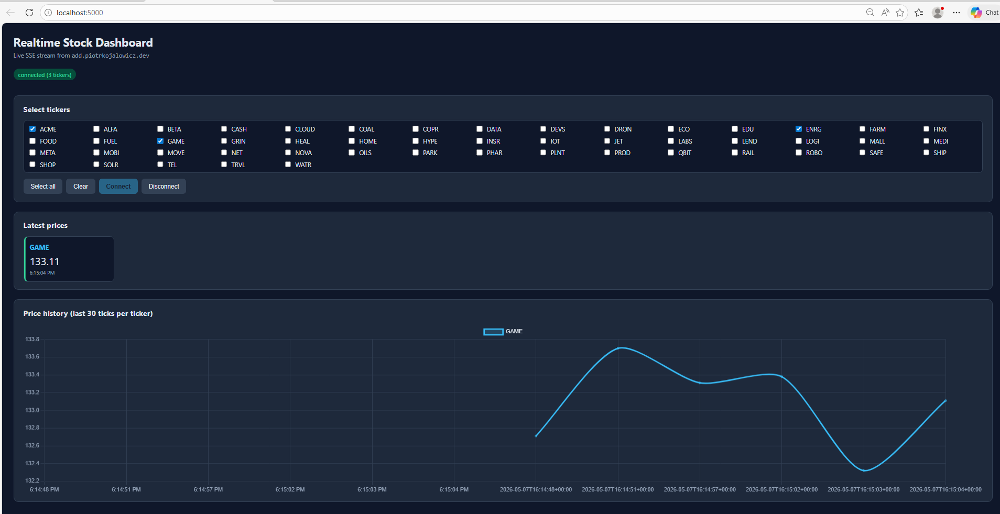

# App #1 — Realtime Dashboard

Live dashboard that subscribes to the instructor's SSE stream
(`/api/stream`) and shows price ticks for the tickers you select, both as
per-ticker cards and as a rolling 30-tick Chart.js line chart.



## Prerequisites

- **Python 3.10+** (tested on 3.12 / 3.13 on Windows 11)
- **pip** (ships with Python)
- A modern browser with `EventSource` support (Chrome/Edge/Firefox/Safari)
- An ADD API key from <https://add.piotrkojalowicz.dev/> (class password
  `[REDACTED]`). The service is open during class hours only (until 19:00) and is
  rate-limited to 1 request per 10s after the first 10 free requests per key.

## Installation

From the **repository root** (so Python finds the shared `.env`):

```powershell
cd app1-dashboard
python -m venv .venv
.venv\Scripts\Activate.ps1
pip install -r requirements.txt
```

On macOS / Linux replace `Activate.ps1` with `source .venv/bin/activate`.

## Configuration

The Flask server reads `ADD_API_KEY` from a `.env` file at the **repo root**
(one level above this folder). Create it once for the whole repo:

```powershell
# from the repo root
Copy-Item .env.example .env
notepad .env   # paste your key in place of "paste_your_key_here"
```

`.env` is gitignored — the key is never committed.

## How to run

With the venv active:

```powershell
python app.py
```

Then open <http://localhost:5000> in your browser. Select one or more
tickers (e.g. `ACME` and `ALFA`) and click **Connect**. Within ~5–10 seconds
you should see the cards updating and the chart drawing lines. Click
**Disconnect** (or close the tab) to stop.

If the upstream API rate-limits you, the status banner turns red and the
EventSource auto-reconnects when the limit clears.

## Endpoints used

| Method  | Path | Purpose |
|---|---|---|
| `GET` | `/api/tickers`                         | Populates the ticker checkbox list. Calls upstream `/api/tickers` once on page load. |
| `GET` | `/api/stream?ticker=…&ticker=…`        | Server-Sent Events stream. The Flask server opens the upstream `/api/stream` with the `X-API-Key` header attached and re-emits every `tick` event verbatim. The browser never sees the API key. |

The browser-facing handler lives in `app.py` (`stream()` function); the
client-side EventSource consumer is in `static/app.js`.
