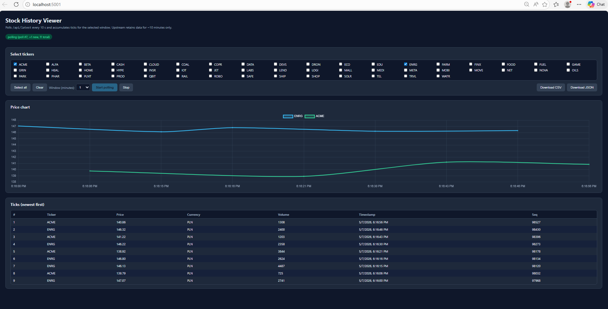
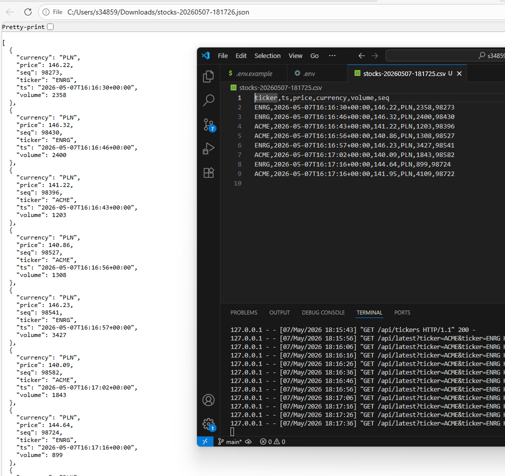

# App #2 — History Downloader / Viewer

Polls the instructor's `/api/latest` endpoint every 10 seconds, accumulates a
moving window of ticks (1 / 2 / 5 / 10 minutes), shows the result as both a
table and a Chart.js multi-line chart, and lets you save the current window
as CSV or JSON.




> **Important constraint.** The upstream API only retains data for ~10
> minutes. This app cannot reach back into the past — it builds the window
> *forward* from the moment you click **Start polling**. So if you select a
> 10-minute window, you have to leave the app polling for ~10 minutes before
> the window is full.

## Prerequisites

- **Python 3.10+** (tested on 3.12 / 3.13 on Windows 11)
- **pip** (ships with Python)
- A modern browser
- An ADD API key from <https://add.piotrkojalowicz.dev/> (class password
  `[REDACTED]`). Service is open during class hours only; rate-limited to
  1 request / 10 s after the first 10 free.

## Installation

From the **repository root**:

```powershell
cd app2-history
python -m venv .venv
.venv\Scripts\Activate.ps1
pip install -r requirements.txt
```

On macOS / Linux replace `Activate.ps1` with `source .venv/bin/activate`.

## Configuration

The Flask server reads `ADD_API_KEY` from a `.env` file at the **repo root**
(one level above this folder). If you've already created it for App #1, you
can skip this step. Otherwise:

```powershell
# from the repo root
Copy-Item .env.example .env
notepad .env   # paste your key in place of "paste_your_key_here"
```

`.env` is gitignored — the key is never committed.

## How to run

With the venv active:

```powershell
python app.py
```

The app runs on **port 5001** (so you can run it at the same time as App #1
on port 5000). Open <http://localhost:5001> in your browser, then:

1. Select one or more tickers.
2. Choose a window (1 / 2 / 5 / 10 minutes).
3. Click **Start polling** — the table fills in over time, one new row per
   ticker per poll.
4. Once you have data, click **Download CSV** or **Download JSON** to save
   the *current window* (everything newer than now − N minutes).
5. Click **Stop** when done.

## Endpoints used

| Method  | Path | Purpose |
|---|---|---|
| `GET` | `/api/tickers`                         | Populates the ticker checkbox list. Calls upstream `/api/tickers` once on page load. |
| `GET` | `/api/latest?ticker=…&ticker=…`        | Polled every 10 s by the browser. The Flask server forwards the request to upstream `/api/latest` with the `X-API-Key` header attached. |

The CSV/JSON export is performed entirely in the browser (`Blob` +
`<a download>`), so no extra server endpoint is needed and the API key
never leaves the server.

## Output file shape

- **CSV** — columns: `ticker, ts, price, currency, volume, seq`. RFC-4180
  quoting for fields that contain `,` or `"`.
- **JSON** — array of objects with the same fields, pretty-printed with
  2-space indent.

Filenames include a timestamp slug, e.g. `stocks-20260507-153012.csv`.
